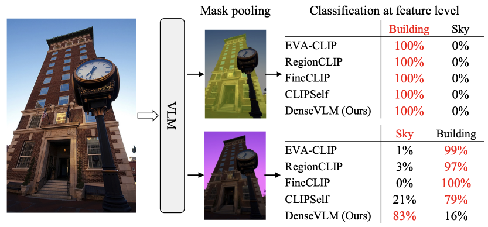
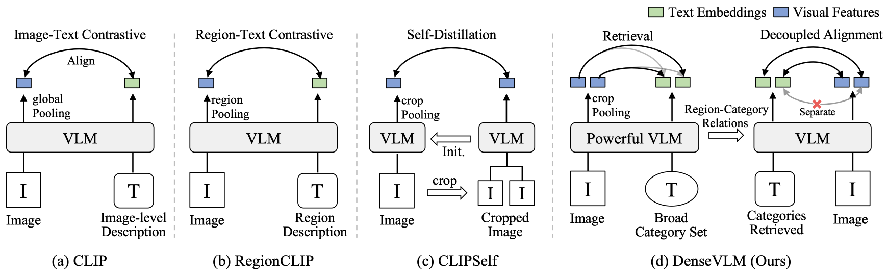
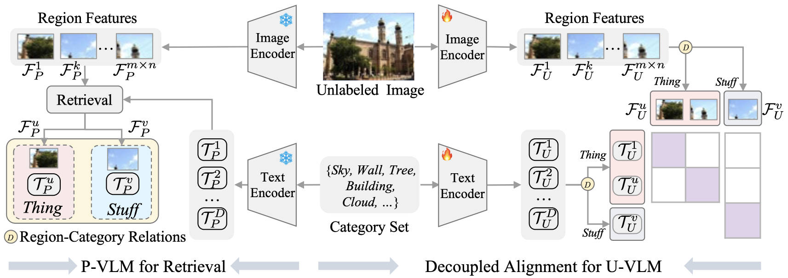
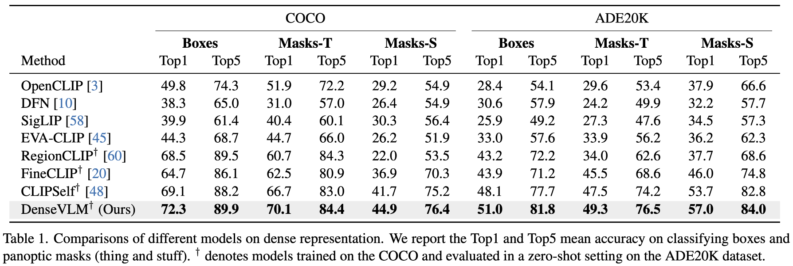
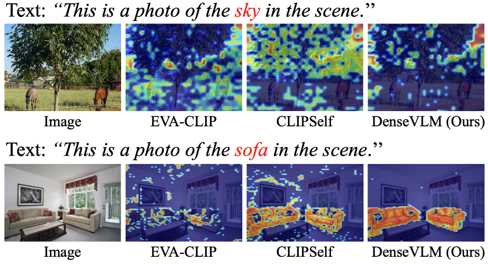

<p align="center">
  <h1 align="center">Unbiased Region-Language Alignment for Open-Vocabulary Dense Prediction</h1>
    <p align="center">
    <a href="https://lyhisme.github.io/"><strong>Yunheng Li</strong></a>
    ·
    <a href="https://zcablii.github.io/"><strong>Yuxuan Li</strong></a>
    ·
    <a href="https://github.com/ashun989"><strong>Quansheng Zeng</strong></a>
    ·
    <a href="https://whai362.github.io/"><strong>Wenhai Wang</strong></a>
    ·
    <a href="https://houqb.github.io/"><strong>Qibin Hou†</strong></a>
    ·
    <a href="https://mmcheng.net/cmm/"><strong>Ming-Ming Cheng</strong></a>
  </p>
  <h2 align="center">Accepted By ICCV 2025!</h2>

### [[Paper](https://arxiv.org/pdf/2412.06244)] [[Github](https://github.com/HVision-NKU/DenseVLM)] [[Pretrained models](https://github.com/HVision-NKU/DenseVLM/tree/main#)] 

## Contributions
- 🔥 We identify the foreground bias issue in existing VLMs and propose region-text alignment by incorporating explicit semantic structuring through category guidance. 
- 🔥 We propose DenseVLM, a region-language alignment framework that uses a strong VLM to retrieve categories for unlabeled regions and decouples foreground and background features to reduce foreground bias. 
- 🔥 Extensive experiments on dense prediction benchmarks show that our DenseVLM outperforms previous methods and exhibits promising scalability.

<p align="center">
  
  
</p>

## Overview

DenseVLM is an unsupervised fine-tuning framework for open-vocabulary dense prediction tasks, which retrieves region-level semantics from a powerful vision-language model and decouples foreground and background features to achieve unbiased region-language alignment and improved open-vocabulary dense prediction.

<p align="center">
  
</p>

<p align="center">
  
  
</p>


## TODO
- [x] Release the training and inference code of DenseVLM.
- [x] Supports training and inference code for RegionCLIP and CLIPSelf.
- [ ] Release the code to integrate DenseVLM into CAT-Seg.
- [ ] Release the code to integrate DenseVLM into F-ViT.

## Quick Start
- 🚀 Linux system with CUDA 11.8
- 🚀 At least one RTX 3090 GPU (4 GPUs are default for training ～23min/epoch)

#### 1. Create Conda Environment
- The provided environment is suggested for reproducing our results, similar configurations may also work.

```
git clone git@github.com:HVision-NKU/DenseVLM.git
cd DenseVLM

conda create -n DenseVLM python=3.8.20
conda activate DenseVLM
pip install -r requirements.txt
pip install -e . -v
```

#### 2. Data Preparation
The main experiments are conducted using images from [COCO](https://cocodataset.org/#home) and [ADE20k](http://sceneparsing.csail.mit.edu) datasets. Please prepare datasets and organize them like the 
following:

```text
DenseVLM/
├── data
    ├── coco
        ├── annotations
            ├── instances_train2017.json  
            ├── panoptic_val2017.json
            ├── panoptic_val2017/    
        ├── train2017/
        ├── val2017/
        ├── coco_pseudo_4764.json
        ├── coco_proposals.json     
    ├── ADEChallengeData2016
        ├── ade20k_panoptic_val/
        ├── images/validation/
        ├── ade20k_panoptic_val.json 
```

#### 3. Checkpoints
Please download the pretrained weights from [huggingface](https://huggingface.co/lyhisme/DenseVLM) and organize them like the 
```text
DenseVLM/
├── checkpoints
    ├── EVA02_CLIP_B_psz16_s8B.pt    
    ├── clipself_coco_6_save6_512_eva_vitl14_24layers.pt  
    ├── densevlm_coco_6_save6_512_eva_vib16_12layers.pt
```

If using a fine-tuned CLIP, you can directly use it. For example:

```python
model = open_clip.create_model(
    'EVA02-CLIP-B-16', pretrained='eva', cache_dir='checkpoints/densevlm_coco_6_save6_512_eva_vib16_12layers.pt'
)
```

#### 4. Training and Testing 

To fine-tune the CLIP model using densevlm, run:
```bash
bash scripts/train_densevlm_coco_image_patches_eva_vitb16.sh 
```

To evaluate the CLIP model fine-tuned with densevlm, run:
```bash
bash scripts/test_coco_eva_vitb16_macc_boxes_masks.sh path/to/checkpoint.pt 2 densevlm_coco_test

bash scripts/test_ade_eva_vitb16_macc_boxes_masks.sh path/to/checkpoint.pt 2 densevlm_ade_test
```

## 🙏 Citation:
If you find this project useful, please consider citing:

```bibtex
@article{li2024densevlm,
  title={Unbiased Region-Language Alignment for Open-Vocabulary Dense Prediction},
  author={Li, Yunheng and Li, Yuxuan and Zeng, Quansheng and Wang, Wenhai and Hou, Qibin and Cheng, Ming-Ming},
  journal={arXiv preprint arXiv:2412.06244},
  year={2024}
}

@InProceedings{li2024cascadeclip,
  title={Cascade-{CLIP}: Cascaded Vision-Language Embeddings Alignment for Zero-Shot Semantic Segmentation},
  author={Li, Yunheng and Li, Zhong-Yu and Zeng, Quan-Sheng and Hou, Qibin and Cheng, Ming-Ming},
  booktitle={Proceedings of the 41st International Conference on Machine Learning},
  pages={28243--28258},
  year={2024},
  volume={235},
  month={21--27 Jul},
  publisher={PMLR}
}
```

## License
Licensed under a [Creative Commons Attribution-NonCommercial 4.0 International](https://creativecommons.org/licenses/by-nc/4.0/) for Non-commercial use only.
Any commercial use should get formal permission first.

